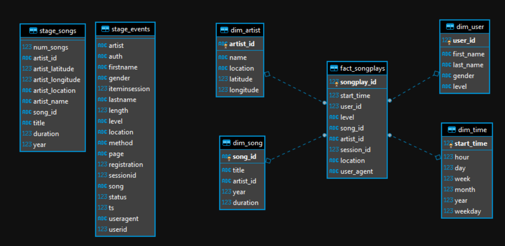

# Project: Data Warehouses on Redshift

This project includes four files:

- create_table.py Create fact and dimension tables for the star schema in Redshift.
- etl.py Load data from S3 into staging tables on Redshift and then process that data into analytics tables on Redshift.
- sql_queries.py Define SQL statements, which will be imported into the two other files above.
- README.md Provide discussion and decisions for this ETL pipeline.

# Discussion and decisions for this ETL pipeline

## 1. The purpose of this database in context of the startup, Sparkify, and their analytical goals.

__Introduction__

A startup called Sparkify wants to analyze the data they've been collecting on songs and user activity on their new music streaming app. The analytics team is particularly interested in understanding what songs users are listening to. Currently, they don't have an easy way to query their data, which resides in a directory of JSON logs on user activity on the app, as well as a directory with JSON metadata on the songs in their app.

This project create a Data Warehouse on AWS Redshift with tables designed to optimize queries on song play analysis.

__Questions to anwser__

- What songs users are listening to? (Currently, they don't have an easy way to query their data)

__Project Datasets__

- Song data: s3://udacity-dend/song_data
- Log data: s3://udacity-dend/log_data
- Log data json path: s3://udacity-dend/log_json_path.json

## 2. Database schema design and ETL pipeline defense.




### fact_songplay table

Distribution key and sortkey for this table was made based on:

SAMPLE QUESTIONS:

0. What songs users are listening to? (Currently, they don't have an easy way to query their data)

```sql
SORTKEY (song_id, user_id)
```

1. Give me the artist, song title and song's length in the music app history that was heard during sessionId = 338, and itemInSession = 4

```sql
SORTKEY (song_id, session_id)
```

2. Give me only the following: name of artist, song (sorted by itemInSession) and user (first and last name) for userid = 10, sessionid = 182

```sql
SORTKEY (song_id, user_id, session_id)
```

3. Give me every user name (first and last) in my music app history who listened to the song 'All Hands Against His Own'

```sql
SORTKEY (song_id, user_id)
```

At the end was built

```sql
CREATE TABLE IF NOT EXISTS fact_songplays
(
    songplay_id bigint IDENTITY(0,1) NOT NULL
    ,start_time bigint      REFERENCES dim_time (start_time)
    ,user_id integer        REFERENCES dim_user (user_id)
    ,level varchar(4)       -- paid or free
    ,song_id varchar(30)    NULL REFERENCES dim_song (song_id)
    ,artist_id varchar(30)  NULL REFERENCES dim_artist (artist_id)
    ,session_id integer
    ,location varchar(255)
    ,user_agent varchar(400)
    ,PRIMARY KEY (songplay_id)
)
DISTSTYLE KEY
DISTKEY (song_id)
COMPOUND SORTKEY (start_time, song_id, user_id, session_id)
```

This table use the above distkey and sort key because:

- SORTKEY considerations:
    - It's often necessary to filter data by date and time, so sort by start_time will help to accelarate the queries that filter by date and time because redshift will be able to skip blocks that fall outside the time range
    - I choose COMPOUND because the data will be sorted in the same order that the sortkey columns and the table filter will be probably done by sortkey columns and the type INTERLEAVED isn't a good choose for columns like datetime and autoincrements id's

- DISTKEY consideration:
    - By start_time is not a good because. Performance and parallelism may decrease depending on the data period fetched. For example, data for an entire month can be in a single slice (cpu)
    - We can have just one distkey per table, and the best practices tells to us to choose based on how frequently it is joined and the size of the joining rows.
    - If i filter by date, the highest cardinality on the result set will be users. The ids of songs will be restricted. But we don't need to now the users name or something like that, we need to answer questions about songs and artists. So the most frequent join will be with songs.
    - Spotfy has about 70 million of tracks (https://newsroom.spotify.com/company-info/), so we have a good cardinality to use this a distkey
    - Population is about 7.594 billion


### Notes about inserts

1. fact_songplays

To find identification for song and artists in event data was made:

```sql
ALTER TABLE stage_events ADD COLUMN song_id varchar(30);
ALTER TABLE stage_events ADD COLUMN artist_id varchar(30);

UPDATE stage_events
  SET song_id = dim_song.song_id,
  artist_id = dim_song.artist_id
FROM dim_song
JOIN dim_artist ON (dim_artist.artist_id = dim_song.artist_id)
WHERE
  dim_song.title = BTRIM(stage_events.song)
  and dim_artist.name = BTRIM(stage_events.artist)
  and dim_song.duration = stage_events.length
;
-- update rows 307

UPDATE stage_events
  SET song_id = dim_song.song_id,
  artist_id = dim_song.artist_id
FROM dim_song
JOIN dim_artist ON (dim_artist.artist_id = dim_song.artist_id)
WHERE
  dim_song.title = BTRIM(stage_events.song)
  AND dim_artist.name = BTRIM(stage_events.artist)
  AND (stage_events.artist_id is null or stage_events.song_id is null)
;
--UPDATED ROWS 14
```

This decision was done because:

- Can exists the same song title belonging to diferente artists like song hello
- Was found spaces in song's titles and artist's names, so was used BTRIM during inserts and in this query
- The first updade is better because match 3 fields of song (title,artist name and song length)
- There are more problems with the dataset, but only those mentioned above were addressed, following the requirements of the project


## 3. Example queries and results for song play analysis.

### What songs users are listening to? (Currently, they don't have an easy way to query their data)

```sql
SELECT
	DISTINCT
	s.title
	,a."name" as artist_name
FROM fact_songplays ev
JOIN dim_song s on (s.song_id = ev.song_id)
JOIN dim_artist a on (a.artist_id = s.artist_id)
LIMIT 5
;

/*
title                                |artist_name|
-------------------------------------|-----------|
One Year_ Six Months                 |Yellowcard |
Please Don't Go                      |No Mercy   |
Setanta matins                       |Elena      |
English Summer Rain                  |Placebo    |
Revolution Deathsquad (Album Version)|Dragonforce|
*/
```

### Give me only the following: name of artist, song (sorted by itemInSession) and user (first and last name) for userid = 10, sessionid = 182

```sql

SELECT
	s.title
	,a."name" as artist_name
FROM fact_songplays ev
JOIN dim_song s on (s.song_id = ev.song_id)
JOIN dim_user u on (u.user_id = ev.user_id)
JOIN dim_artist a on (a.artist_id = s.artist_id)
WHERE
	ev.session_id = 182
	and ev.user_id = 10
ORDER BY
	ev.start_time
	,u.first_name
	,u.last_name
;


/*
title                                               |artist_name  |
----------------------------------------------------|-------------|
Catch You Baby (Steve Pitron & Max Sanna Radio Edit)|Lonnie Gordon|
*/
```

### Total music listened to per month

```sql

SELECT
	t."year"
	,t."month"
	,count(0) as total
FROM fact_songplays ev
JOIN dim_time t ON (t.start_time = ev.start_time)
GROUP BY
	t."year"
	,t."month"
ORDER BY
	t."year" DESC
	,t."month" DESC
;


/*
year|month|total|
----|-----|-----|
2018|   11| 6839|
*/
```

### Totals

```sql
select
	(select count(0) from (select DISTINCT ts AS start_time from stage_events where page='NextSong')) as total_time_on_events
	,(select count(0) from (select DISTINCT userid from stage_events where page='NextSong')) as total_users_on_events
	,(select count(0) from (select DISTINCT song_id, artist_id from stage_songs)) as total_songs_on_songdata
	,(select count(0) from (select DISTINCT song_id from stage_songs)) as total_songsid_on_songdata
	,(select count(0) from (select DISTINCT artist_id from stage_songs)) as total_artist_on_songdata
	,(select sum(duration) from stage_songs) as total_song_duration_on_songdata
	,(select sum(duration) from dim_song) as total_song_duration_on_dimsong
;

/*
Name                           |Value         |
-------------------------------|--------------|
total_time_on_events           |6813          |
total_users_on_events          |96            |
total_songs_on_songdata        |14896         |
total_songsid_on_songdata      |14896         |
total_artist_on_songdata       |9553          |
total_song_duration_on_songdata|3676025.85291 |
total_song_duration_on_dimsong |3676025.852910|
 */
```


```sql
SELECT
	(SELECT COUNT(0) FROM dim_artist)  AS total_artists
	,(SELECT COUNT(0) FROM dim_song)  AS total_songs
	,(SELECT COUNT(0) FROM dim_user)  AS total_users
	,(SELECT COUNT(0) FROM dim_time)  AS total_time
	,(SELECT COUNT(0) FROM stage_events)  AS stage_events
	,(SELECT COUNT(0) FROM stage_songs)  AS stage_songs
	,(select count(0) FROM fact_songplays where song_id > 0) AS total_with_song_id
;

/*
Name              |Value|
------------------|-----|
total_artists     |9553 |
total_songs       |14896|
total_users       |96   |
total_time        |6813 |
stage_events      |8056 |
stage_songs       |14896|
total_with_song_id|305  |
*/
```

#### Song and artists problems

```sql
select
(
	SELECT COUNT(0)
	FROM stage_events ev
	LEFT JOIN dim_song s ON (BTRIM(s.title) = BTRIM(ev.song))
	WHERE s.title is null
) as songtitle_in_events_and_not_in_songdataset
,
(
	SELECT COUNT(0)
	FROM stage_events ev
	LEFT JOIN dim_artist a ON (BTRIM(a."name") = BTRIM(ev.artist))
	WHERE a."name" is null
) as artist_name_in_events_and_not_in_songdataset
,(
	SELECT COUNT(0) FROM fact_songplays WHERE song_id IS NULL OR artist_id IS NULL
) AS fact_events_without_songid_and_artistid
;

/*
Name                                        |Value|
--------------------------------------------|-----|
songtitle_in_events_and_not_in_songdataset  |7246 |
artist_name_in_events_and_not_in_songdataset|3886 |
fact_events_without_songid_and_artistid     |7751 |
*/
```