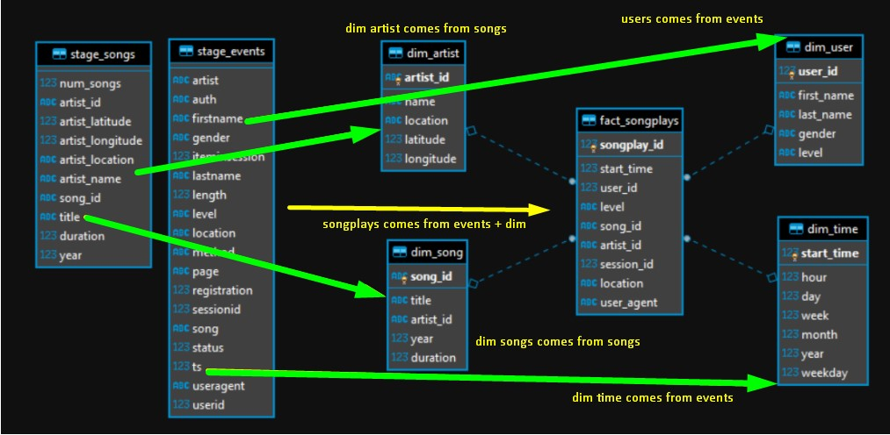

# This project includes three files:

- etl.py Reads data from S3, processes that data using Spark, and writes them back to S3.
- dl.cfg Define configurations and AWS credentials.
- README.md Provide discussion and decisions for this ETL pipeline.

# Discussion and decisions for this ETL pipeline

## 1. The purpose of this data lake in context of the startup, Sparkify, and their analytical goals.

__Introduction__

A music streaming startup, Sparkify, has grown their user base and song database even more and want to move their data warehouse to a data lake. Their data resides in S3, in a directory of JSON logs on user activity on the app, as well as a directory with JSON metadata on the songs in their app.

This project create an ETL pipeline for a data lake hosted on S3 that extracts their data from S3, processes them using Spark, and loads the data back into S3 as a set of dimensional and fact tables. This will allow their analytics team to continue finding insights in what songs their users are listening to.

__Questions to anwser__

- What songs users are listening to?
- How many paying users are there?
- How many users downgraded the plan in the month?
- and others..

__Project Datasets__

- Song data: s3://udacity-dend/song_data
- Log data: s3://udacity-dend/log_data

## Song Dataset

The first dataset is a subset of real data from the Million Song Dataset. Each file is in JSON format and contains metadata about a song and the artist of that song. The files are partitioned by the first three letters of each song's track ID. For example, here are filepaths to two files in this dataset:

```txt
song_data/A/B/C/TRABCEI128F424C983.json
song_data/A/A/B/TRAABJL12903CDCF1A.json
```

And below is an example of what a single song file, TRAABJL12903CDCF1A.json, looks like.

```json
{"num_songs": 1, "artist_id": "ARJIE2Y1187B994AB7", "artist_latitude": null, "artist_longitude": null, "artist_location": "", "artist_name": "Line Renaud", "song_id": "SOUPIRU12A6D4FA1E1", "title": "Der Kleine Dompfaff", "duration": 152.92036, "year": 0}
```

## Log Dataset

The second dataset consists of log files in JSON format generated by this event simulator based on the songs in the dataset above. These simulate app activity logs from an imaginary music streaming app based on configuration settings.

The log files in the dataset you'll be working with are partitioned by year and month. For example, here are filepaths to two files in this dataset.

```txt
log_data/2018/11/2018-11-12-events.json
log_data/2018/11/2018-11-13-events.json
```

And below is an example of what the data in a log file, 2018-11-12-events.json, looks like.

```json
{"artist":null,"auth":"Logged In","firstName":"Walter","gender":"M","itemInSession":0,"lastName":"Frye","length":null,"level":"free","location":"San Francisco-Oakland-Hayward, CA","method":"GET","page":"Home","registration":1540919166796.0,"sessionId":38,"song":null,"status":200,"ts":1541105830796,"userAgent":"\"Mozilla\/5.0 (Macintosh; Intel Mac OS X 10_9_4) AppleWebKit\/537.36 (KHTML, like Gecko) Chrome\/36.0.1985.143 Safari\/537.36\"","userId":"39"}
{"artist":"Des'ree","auth":"Logged In","firstName":"Kaylee","gender":"F","itemInSession":1,"lastName":"Summers","length":246.30812,"level":"free","location":"Phoenix-Mesa-Scottsdale, AZ","method":"PUT","page":"NextSong","registration":1540344794796.0,"sessionId":139,"song":"You Gotta Be","status":200,"ts":1541106106796,"userAgent":"\"Mozilla\/5.0 (Windows NT 6.1; WOW64) AppleWebKit\/537.36 (KHTML, like Gecko) Chrome\/35.0.1916.153 Safari\/537.36\"","userId":"8"}
```


## 2. Database schema design and ETL pipeline defense.




### Resources in use:

__DataFrames__

The dataframe api were used because internally spark can do richer optimizations under the hood.
This concept is equivalent to a table in a relational database and it's easer do some joins, select or agregation using SQL and dataframe api.

__S3A client__

S3A client support were used for perfomance improvement, Hadoop’s “S3A” client offers high-performance IO against Amazon S3 object store and compatible implementations.

### table's partitions:

- Songs table files are partitioned by year and then artist
- Time table files are partitioned by year and month
- Songplays table files are partitioned by year and month

# How to run

1. Clone this repository to your local machine

```shell
git clone https://github.com/paulo3011/sparkfy.git
```

2. Enter on the directory on that were cloned the repository:

```shell
cd ~/projects/paulo3011/sparkfy/project4-datalake-on-aws/runtime/
```

3. Execute de python script

```shell
python etl.py
```

# Settings in use

## fs.s3a.multipart.size

How big (in bytes) to split upload or copy operations up into. A suffix from the set {K,M,G,T,P} may be used to scale the numeric value.

Seealso: https://hadoop.apache.org/docs/current/hadoop-aws/tools/hadoop-aws/index.html

## spark.jars.packages

Comma-separated list of Maven coordinates of jars to include on __the driver and executor classpaths__. The coordinates should be groupId:artifactId:version. If spark.jars.ivySettings is given artifacts will be resolved according to the configuration in the file, otherwise artifacts will be searched for in the local maven repo, then maven central and finally any additional remote repositories given by the command-line option --repositories.

Seealso: https://spark.apache.org/docs/latest/configuration.html

## org.apache.hadoop:hadoop-aws

This jar is used to include S3A client support.

Seealso: https://hadoop.apache.org/docs/current/hadoop-aws/tools/hadoop-aws/index.html

## spark.sql.adaptive.enabled

This feature coalesces the post shuffle partitions based on the map output statistics when both spark.sql.adaptive.enabled and spark.sql.adaptive.coalescePartitions.enabled configurations are true. This feature simplifies the tuning of shuffle partition number when running queries. You do not need to set a proper shuffle partition number to fit your dataset. Spark can pick the proper shuffle partition number at runtime once you set a large enough initial number of shuffle partitions via spark.sql.adaptive.coalescePartitions.initialPartitionNum configuration

## spark.sql.adaptive.coalescePartitions.enabled

When true and spark.sql.adaptive.enabled is true, Spark will coalesce contiguous shuffle partitions according to the target size (specified by spark.sql.adaptive.advisoryPartitionSizeInBytes), to avoid too many small tasks.

## spark.sql.adaptive.skewJoin.enabled

When true and spark.sql.adaptive.enabled is true, Spark dynamically handles skew in sort-merge join by splitting (and replicating if needed) skewed partitions.

# References

- https://hadoop.apache.org/docs/current/hadoop-aws/tools/hadoop-aws/index.html
- https://spark.apache.org/docs/latest/configuration.html
- https://docs.qubole.com/en/latest/user-guide/engines/spark/spark-supportability.html
- http://hortonworks.com/wp-content/uploads/2016/03/asparagus-chart-hdp24.png
- https://spark.apache.org/docs/latest/api/python/getting_started/install.html#dependencies
- https://spark.apache.org/downloads.html
- https://stackoverflow.com/questions/60172792/reading-data-from-s3-using-pyspark-throws-java-lang-numberformatexception-for-i
- https://docs.cloudera.com/HDPDocuments/HDP3/HDP-3.1.5/bk_cloud-data-access/content/s3a-fast-upload-config.html
- https://stackoverflow.com/questions/31610971/spark-repartition-vs-coalesce
- https://mungingdata.com/apache-spark/broadcast-joins/
- https://www.slideshare.net/databricks/introducing-dataframes-in-spark-for-large-scale-data-science (logical plan)
- https://commons.wikimedia.org/wiki/File:SQL_Joins.svg
- https://spark.apache.org/docs/3.1.1/api/python/reference/pyspark.sql.html#functions
- https://spark.apache.org/docs/latest/sql-performance-tuning.html#adaptive-query-execution