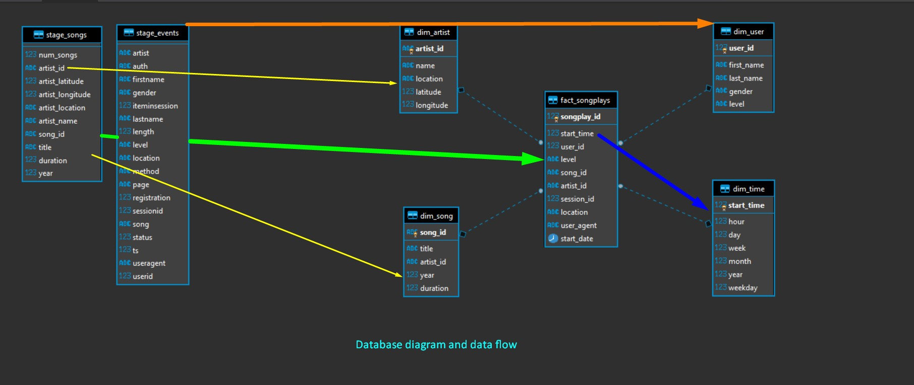
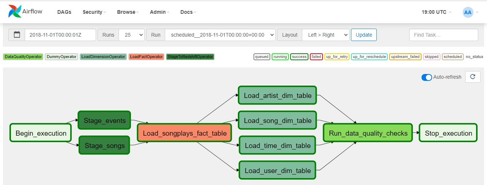

# Data Pipelines with Airflow

__Introduction:__

A music streaming startup, Sparkify, has decided that it is time to introduce more automation and monitoring to their data warehouse ETL pipelines and come to the conclusion that the best tool to achieve this is Apache Airflow.

They want to create high grade data pipelines that are dynamic and built from reusable tasks, can be monitored, and allow easy backfills. They have also noted that the data quality plays a big part when analyses are executed on top the data warehouse and want to run tests against their datasets after the ETL steps have been executed to catch any discrepancies in the datasets.

The source data resides in S3 and needs to be processed in Sparkify's data warehouse in Amazon Redshift. The source datasets consist of JSON logs that tell about user activity in the application and JSON metadata about the songs the users listen to.

To complete the project, __will be build four different operators that will stage the data, transform the data, and run checks on data quality__. All of the operators and task instances will run SQL statements against the Redshift database.

## Stage Operator

The stage operator is expected to be able to load any JSON formatted files from S3 to Amazon Redshift. The operator creates and runs a SQL COPY statement based on the parameters provided. The operator's parameters should specify where in S3 the file is loaded and what is the target table.

The parameters should be used to distinguish between JSON file. Another important requirement of the stage operator is containing a templated field that allows it to load timestamped files from S3 based on the execution time and run backfills.

## Fact and Dimension Operators

Most of the logic is within the SQL transformations and the operator is expected to take as input a SQL statement and target database on which to run the query against. Also can be define a target table that will contain the results of the transformation.

Dimension loads are often done with the truncate-insert pattern where the target table is emptied before the load. Thus, will be create a parameter that allows switching between insert modes when loading dimensions. Fact tables are usually so massive that they should only allow append type functionality.

__Note:__ The parameter implemented that allows switching between insert modes when loading dimensions is sql which can received a set of queries that are sequentially executed. See dim_user insert for more details.

## Data Quality Operator

The final operator is the data quality operator, which is used to run checks on the data itself. The operator's main functionality is to receive one or more SQL based test cases along with the expected results and execute the tests. For each the test, the test result and expected result needs to be checked and if there is no match, the operator should raise an exception and the task should retry and fail eventually.

For example one test could be a SQL statement that checks if certain column contains NULL values by counting all the rows that have NULL in the column. We do not want to have any NULLs so expected result would be 0 and the test would compare the SQL statement's outcome to the expected result.

__This project includes these files:__

- README.md - Provide details about this project;
- create_tables.sql - Create de initial database;
- runtime/dags/sparkfy_dag.py - The airflow DAG implementation of data pipeline;
- runtime/plugins/operators/stage_redshift.py - Implementation of Stage Operator
- runtime/plugins/operators/load_fact.py - Implementation of Fact Operator
- runtime/plugins/operators/load_dimension.py - Implementation of Dimension Operator
- runtime/plugins/operators/data_quality.py - Implementation of Data Quality Operator
- runtime/plugins/helpers/sql_queries.py - Queries used to load data into Redshift
- runtime/plugins/helpers/sql_data_quality_queries.py - Data quality queries

__Project Datasets:__

- Song data: s3://udacity-dend/song_data
- Log data: s3://udacity-dend/log_data

__Song Dataset:__

The first dataset is a subset of real data from the Million Song Dataset. Each file is in JSON format and contains metadata about a song and the artist of that song. The files are partitioned by the first three letters of each song's track ID. For example, here are filepaths to two files in this dataset:

```txt
song_data/A/B/C/TRABCEI128F424C983.json
song_data/A/A/B/TRAABJL12903CDCF1A.json
```

And below is an example of what a single song file, TRAABJL12903CDCF1A.json, looks like.

```json
{"num_songs": 1, "artist_id": "ARJIE2Y1187B994AB7", "artist_latitude": null, "artist_longitude": null, "artist_location": "", "artist_name": "Line Renaud", "song_id": "SOUPIRU12A6D4FA1E1", "title": "Der Kleine Dompfaff", "duration": 152.92036, "year": 0}
```

__Log Dataset:__

The second dataset consists of log files in JSON format generated by this event simulator based on the songs in the dataset above. These simulate app activity logs from an imaginary music streaming app based on configuration settings.

The log files in the dataset you'll be working with are partitioned by year and month. For example, here are filepaths to two files in this dataset.

```txt
log_data/2018/11/2018-11-12-events.json
log_data/2018/11/2018-11-13-events.json
```

And below is an example of what the data in a log file, 2018-11-12-events.json, looks like.

```json
{"artist":null,"auth":"Logged In","firstName":"Walter","gender":"M","itemInSession":0,"lastName":"Frye","length":null,"level":"free","location":"San Francisco-Oakland-Hayward, CA","method":"GET","page":"Home","registration":1540919166796.0,"sessionId":38,"song":null,"status":200,"ts":1541105830796,"userAgent":"\"Mozilla\/5.0 (Macintosh; Intel Mac OS X 10_9_4) AppleWebKit\/537.36 (KHTML, like Gecko) Chrome\/36.0.1985.143 Safari\/537.36\"","userId":"39"}
{"artist":"Des'ree","auth":"Logged In","firstName":"Kaylee","gender":"F","itemInSession":1,"lastName":"Summers","length":246.30812,"level":"free","location":"Phoenix-Mesa-Scottsdale, AZ","method":"PUT","page":"NextSong","registration":1540344794796.0,"sessionId":139,"song":"You Gotta Be","status":200,"ts":1541106106796,"userAgent":"\"Mozilla\/5.0 (Windows NT 6.1; WOW64) AppleWebKit\/537.36 (KHTML, like Gecko) Chrome\/35.0.1916.153 Safari\/537.36\"","userId":"8"}
```

## 2. Database schema diagram




## 3. Airflow DAG:



# Run the code

1. Start the airflow using docker-compose

```shell
$ # enter on your docker directory
$ cd ~/projects/paulo3011/sparkfy/project6-data-pipelines/docker
$ # inicie o docker compose in background
$ docker-compose up -d
```
2. start the scheduler

```shell
$ # login on airflow instance
$ docker exec -it airflow-v2.0.1 bash
$ # start airflow scheduler
$ airflow scheduler &
$ # Access on browser http://localhost:8080/
```

# Airflow cli commands

```shell
usage: airflow [-h] GROUP_OR_COMMAND ...

positional arguments:
  GROUP_OR_COMMAND

    Groups:
      celery         Celery components
      config         View configuration
      connections    Manage connections
      dags           Manage DAGs
      db             Database operations
      kubernetes     Tools to help run the KubernetesExecutor
      pools          Manage pools
      providers      Display providers
      roles          Manage roles
      tasks          Manage tasks
      users          Manage users
      variables      Manage variables

    Commands:
      cheat-sheet    Display cheat sheet
      info           Show information about current Airflow and environment
      kerberos       Start a kerberos ticket renewer
      plugins        Dump information about loaded plugins
      rotate-fernet-key
                     Rotate encrypted connection credentials and variables
      scheduler      Start a scheduler instance
      sync-perm      Update permissions for existing roles and DAGs
      version        Show the version
      webserver      Start a Airflow webserver instance

optional arguments:
  -h, --help         show this help message and exit
```

To test load and run the dag file you can use:

```shell
# airflow dags test [dag_id] 2021-04-13
# sample:
airflow dags test sparkfy_dag 2021-04-13
```

To check if some dag file is without error you can do:

```shell
docker exec -it airflow-v2.0.1 bash
python dags/sparkfy_dag.py
```

# Configure redshift connection

On create connection page, enter the following values:

- Conn Id: Enter redshift.
- Conn Type: Enter Postgres.
- Host: Enter the endpoint of your Redshift cluster, excluding the port at the end. You can find this by selecting your cluster in the Clusters page of the Amazon Redshift console. See where this is located in the screenshot below. IMPORTANT: Make sure to NOT include the port at the end of the Redshift endpoint string.
- Schema: Enter dev. This is the Redshift database you want to connect to.
- Login: Enter awsuser.
- Password: Enter the password you created when launching your Redshift cluster.
- Port: Enter 5439.

# References

- https://www.youtube.com/watch?v=wDr3Y7q2XoI
